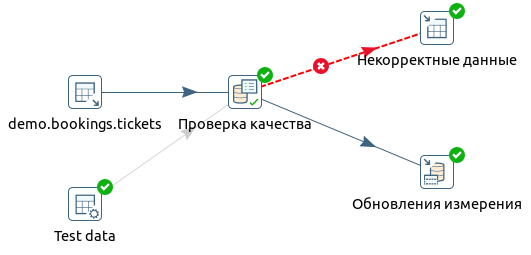

# Загрузка таблиц фактов и измерений
## Допущения:
* В рамках задачи примем, что измерения не изменяются
* Таблицы измерений не нужно улучшать, а грузить, как есть
   
## Справочник пассажиров
### Загрузка
Для загрузки данных используем шаг _Table Input_, дополнительно разделив поля ФИО и контакты на составные части (потребуются для проверки):
```sql
SELECT DISTINCT passenger_id,
                passenger_name,
                SPLIT_PART(passenger_name, ' ', 1)                           first_name,
                SPLIT_PART(passenger_name, ' ', 2)                           last_name,
                contact_data,
                (REGEXP_REPLACE(contact_data ->> 'phone', '\D', ''))::bigint phone,
                contact_data ->> 'email'                                     email
  FROM bookings.tickets;
```

### Проверка качества
Фильтруем с помощью _Filter rows_
* Формат документа (паспорта) — 4 цифры — серия паспорта + 6 цифр - номер
* ФИО пассажира — только латинские буквы и тире, минимальная длина - 2 символа
* контакты пассажира обязательно должны включать номер телефона
* номер телефона — 11 цифр
* email — формат email

### Некорректные данные
С помощью шага _Table output_ пишутся в таблицу `rejected_dim_passengers`
                             
### Корректные данные
Для записи в таблицу `dim_passengers` используем шаг _Insert / update_, чтобы не удалять таблицу целиком и не записывать дубли. Матчим по полю `passenger_code`  



## Справочник самолетов
### Загрузка
Для загрузки данных используем шаг _Table Input_:
```sql
SELECT * FROM bookings.aircrafts;
```

### Проверка качества
Фильтруем с помощью _Filter rows_
* Максимальная дальность полета (range) должна быть положительным числом
* Код типа самолета ИАТА (aircraft_code) — код из 3 знаков (букв латинского алфавита и цифр)
* Модель самолета — латинские буквы, цифры, тире и пробельный символ

### Некорректные данные
С помощью шага _Table output_ пишутся в таблицу `rejected_dim_aircrafts`

### Корректные данные
Для записи в таблицу `dim_aircrafts` используем шаг _Insert / update_. Матчим по полю `aircraft_code`

       


## Справочник аэропортов
### Загрузка
Для загрузки данных используем шаг _Table Input_:
```sql
SELECT * FROM bookings.airports;
```

### Проверка качества
Фильтруем с помощью _Filter rows_
* Код аэропорта ИАТА (airport_code) — код из 3 букв латинского алфавита
* Широты (latitude) — число в диапазоне [-90, 90]
* Долгота (longitude) — число в диапазоне [-180, 180]

### Некорректные данные
С помощью шага _Table output_ пишутся в таблицу `rejected_dim_airports`

### Корректные данные
Для записи в таблицу `dim_airports` используем шаг _Insert / update_. Матчим по полю `airport_code`


## Справочник тарифов
### Загрузка
Для загрузки данных используем шаг _Table Input_:
```sql
SELECT DISTINCT fare_conditions FROM bookings.seats;
```

### Сохранение данных
Без проверок сразу пишем в таблицу `dim_tariffs`, используя шаг _Insert / update_. Матчим по полю `tariff_code`


## Факты перелетов
### Загрузка
Для загрузки данных используем шаг _Table Input_, сразу просчитав `actual_departure_date_id` и `actual_arrival_date_id`. 
В выборку должны попасть только перелеты с фактическим временем прилета и статусом `Arrived`
```sql
SELECT tf.fare_conditions,                                                                                        -- tariff_id
       tf.amount,                                                                                                 -- amount
       t.passenger_id                                                                     AS passenger_code,
       EXTRACT(EPOCH FROM f.actual_departure) - EXTRACT(EPOCH FROM f.scheduled_departure) AS departure_delay,     -- departure_delay
       EXTRACT(EPOCH FROM f.actual_arrival) -   EXTRACT(EPOCH FROM f.scheduled_arrival)   AS arrival_delay,       -- arrival_delay
       f.departure_airport,                                                                                       -- departure_airport_id
       f.arrival_airport,                                                                                         -- arrival_airport_id
       f.aircraft_code,                                                                                           -- aircraft_id
       f.scheduled_departure                                                              AS scheduled_departure_dt, -- scheduled_departure_dt
       f.scheduled_arrival                                                                AS scheduled_arrival_dt,   -- scheduled_arrival_dt
       f.actual_departure                                                                 AS actual_departure_dt, -- actual_departure_dt
       f.actual_arrival                                                                   AS actual_arrival_dt,   -- actual_arrival_dt
       TO_CHAR(f.actual_departure, 'YYYYMMDD')::int                                       AS actual_departure_date_id,
       TO_CHAR(f.actual_arrival, 'YYYYMMDD')::int                                         AS actual_arrival_date_id
  FROM bookings.flights f
           JOIN bookings.ticket_flights tf ON tf.flight_id = f.flight_id
           JOIN bookings.tickets t ON t.ticket_no = tf.ticket_no
 WHERE f.actual_arrival IS NOT NULL
   AND f.status = 'Arrived';
```

### Проверка качества
Фильтруем с помощью _Filter rows_
* Задержка вылета — число неотрицательное
* Стоимость — число положительное
* Фактическое время прилета не может быть раньше фактического времени вылета

### Некорректные данные
С помощью шага _Table output_ пишутся в таблицу `rejected_fact_flights`

### Подмешивание измерений
С помощью шагов _Combination lookup/update_ ищем идентификаторы ранее загруженных справочников:
* dim_aircrafts (aircraft_code = aircraft_code)
* dim_tariffs (fare_conditions = tariff_code)
* dim_airports (departure_airport = airport_code)
* dim_airports (arrival_airport = airport_code)
* dim_passengers (passenger_code = passenger_code)

### Корректные данные
Для записи в таблицу `fact_flights` используем шаг _Table output_


